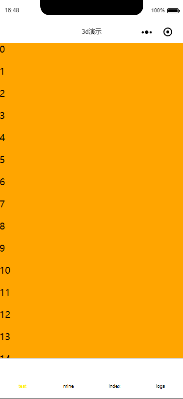

# mini-refreshview
[](https://www.npmjs.com/package/mini-refreshview)  [](https://github.com/mini-plug/mini-RefreshView.git)

[](https://travis-ci.org/mini-plug/mini-RefreshView)


## 实例
  

## 使用方法
 1.  `npm i mini-refreshview` or `yarn add mini-refreshview`
 2. 在`Page`的json文件内添加配置
    ```json
     {
      "usingComponents": {
      "refreshview": "mini-refreshview/refreshview",
      "refreshheader": "mini-refreshview/refreshheader",
      "refreshfooter": "mini-refreshview/refreshfooter"
      }
    }
    ```
 3. [在布局中配置](./tools/demo/pages/index/index.wxml)
    ```xml
    <refreshview id="refreshView"
                isRefresh="{{isRefresh}}"
                isLoadMore='{{isLoadMore}}'
                enableRefresh="{{enableRefresh}}"
                enableLoadMore="{{enableRefresh}}"
                bindonRefresh="onRefresh" 
                bindonLoadMore="onLoadMore">
    
        <refreshheader slot="header">
            <view style='background:#11f111;height:150rpx'>viewHeader</view>
        </refreshheader>
    
        <scroll-view slot="content" style='background:orange;'>
            <view wx:for='{{data}}' wx:key='{{index}}'>{{index}}</view>
        </scroll-view>
    
        <refreshfooter slot="footer">
            <view style="background:#33f111 ;height:150rpx">
                footer
            </view>
        </refreshfooter>

    </refreshview>
    
    ```
 4. 属性
 
    * `properties`
    
        字段名|类型|必填|描述
        :----:|:----:|:----:|:----:
        isRefresh|Boolean|否|控制刷新状态
        isLoadMore|Boolean|否|控制加载状态
        enableRefresh|Boolean|否|是否开启刷新
        enableLoadMore|Boolean|否|是否开启加载
        bindonRefresh|Function|否|刷新状态回调
        bindonLoadMore|Function|否|加载状态回调
    
    * `slot`
    
        名称|描述
        :----:|:----:
        header| 刷新布局(必须为[refreshheader](./src/refreshheader.js))
        content|显示界面
        footer| 加载布局(必须为[refreshfooter](./src/refreshfooter.js))
## 测试
    `npm run dev`
## PS
   若不可滑动,注意 `Page` 的 [`overflow:hidden`](./tools/demo/pages/index/index.wxss)

    


